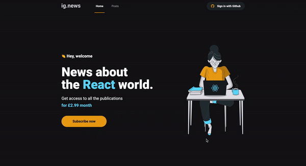

<h1 align="center">
  Ig.news
</h1>


<p align="center">
 <a href="#about-the-project">About the project</a> •
 <a href="#technologies">Technologies</a> •
 <a href="#development-setup">Development Setup</a> •
 <a href="#License">License</a> •
 <a href="#author">Author</a>
</p>


## About the project

The project aims to study and develop an application in ReactJS with NextJS for listing posts and subscription system.

The application was developed using the NextJS framework, applying concepts such as external API consumption, API Root, Server Side Rendering (SSR), Static Site Generation (SSG), STRIPE for subscription payments, NextAuth for authentication with Github, FaunaDB to store the information in a database and Prismic CMS for adding and managing post content.

<div align="center">
    
</div>

---

## Technologies

Technologies used to build the application

- [ReactJS](https://reactjs.org/)
- [NextJS](https://nextjs.org/)
- [TypeScript](https://www.typescriptlang.org/)
- [Chakra-ui](https://chakra-ui.com/)
- [Fauna db](https://fauna.com//)
- [NextAuth](https://next-auth.js.org/)
- [Prismic CMS](https://prismic.io/)
- [Stripe](https://stripe.com/)


---

## Development Setup

### **Requirements**

Dependencies:

- [Git](https://git-scm.com/)
- [Yarn](https://classic.yarnpkg.com)


### **Clone the project**

```bash
# Run the command git clone  to clone the repository
$ git clone https://github.com/hppc25/react-ignews.git
#  change to directory
$ cd react-ignews
```

### **Setup the project**

```bash
# install dependencies
$ yarn

# serve with hot reload at localhost:3000
$ yarn dev

```

---

## License

The MIT License. Checnk [LICENSE](LICENSE) for more information.

---

## Author

By Helder Correia 👋🏽 Get in touch!

[](https://www.linkedin.com/in/helder2pc/)
[](mailto:hppc25@gmail.com)
